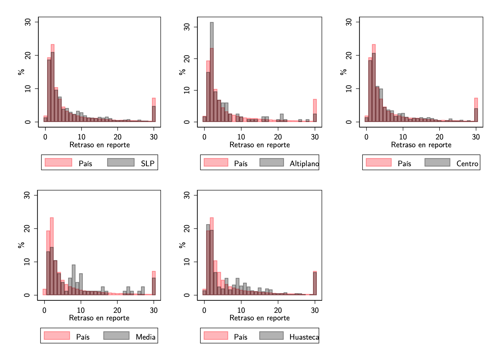
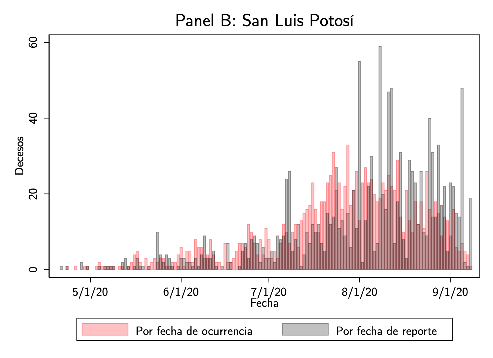

---
output:
  pdf_document: default
geometry: margin=1in
fontsize: 11pt
header-includes :
  \usepackage{geometry}
  \usepackage{graphicx}
  \usepackage{floatrow}
   \floatsetup[figure]{capposition=top}
  \floatsetup[table]{capposition=top}
  \floatplacement{figure}{H}
  \floatplacement{table}{H}
  \tolerance=1
  \emergencystretch=\maxdimen
  \hyphenpenalty=10000
  \hbadness=10000
  \linespread{1.3}
  \usepackage[justification=centering, font=bf, labelsep=period, skip=5pt]{caption} 
  \usepackage{titling}
  \usepackage[spanish]{babel}
  \usepackage{fancyhdr}
  \pagestyle{fancy}
  \fancyhead[L]{Investigación Aplicada I}
  \fancyhead[R]{ITAM}
---
```{r setup, include=FALSE}
knitr::opts_chunk$set(echo = FALSE)
```

# Análisis descriptivo 

El análisis que presenta este trabajo explota precisamente una de las variables que varían entre reportes de casos de Covid-19 en México: la fecha de defunción. Después de identificar los registros reportados en cada fecha, a cada defunción nos es posible asignarle una fecha de reporte (la primera fecha en que esa defunción apareció en la base de datos) y calcular entonces el retraso con el que fue reportado (los días transcurridos entre la fecha de defunción y la fecha de reporte de cada deceso). 

El primer cuadro de la **figura 1** muestra la frecuencia relativa de los retrasos en reportes de los decesos registrados hasta el 8 de septiembre del 2020 para todo el país (en rojo) y el estado de San Luis Potosí (en gris). Asimismo, el resto de los cuadros  compara los retrasos del país con los de cada región del estado.

```{r, out.width="100%", fig.cap="Frecuencia relativa en los retrasos"}

```

Lo que podemos concluir es que los retrasos son grandes y que a nivel estatal tienen una frecuencia relativa similar a la del país. La diferencia considerable entre medias y medianas tanto a nivel estatal (de 4 días), como a nivel regional (que ronda desde los 2 a los 4 días) es evidencia de la dispersión de los retrasos. Sin embargo, cuando desagregamos por región, surjen diferencias notorias. Por ejemplo, la región altiplano es la región con los retrasos más pequeños seguido de la zona centro, ambos reportando más de la mitad de los decesos con menos de 4 días de retraso (en ambas regiones la mediana es igual a 3). Por el contrario, podemos observar que la mediana en la zona media es de 7 días, lo que indica que la mitad de los decesos de sus residentes se reportan después de una semana. Asimismo, también es importante notar que en cuanto a los retrasos mayores a 30 días, el estado junto con todas sus regiones con excepción de la huasteca, tienen un porcentaje menor al del país.

En la **figura 2** se muestran los retrasos promedio en el reporte de decesos por municipio y por región de residencia. Si bien existen municipios en la región altiplano y centro que se encuentran entre aquellos con mayores retrasos promedio, a nivel regional tienen el primer y segundo promedio más pequeño, con 6 y 7 días respectivamente^[ La cifra exacta es de 5.9 y 7 días ], lo que indica que a pesar de los grandes retrasos en algunos municipios, estos se deben a relativamente pocos decesos y apenas modifican al promedio regional.  Por el contrario, en la región huasteca y zona media ocurre que el promedio de los municipios es mayor de manera generalizada y, en consecuencia, las regiones tienen los mayores promedios en retrasos, con 9 y 10 días respectivamente^[ La cifra exacta es de 8.52 y 9.6 días ].

```{r, out.width="100%", fig.cap="Retrasos promedio en los decesos por municipio (izquierda) y por región (derecha) de residencia"}
knitr::include_graphics("archivos/delaysmunvsregions.png")
```
 
Finalmente, las **figuras 3 y 4** muestran la evolución de los decesos diarios de acuerdo con la fecha en que ocurrieron (en rojo) y la fecha en que fueron reportados (en gris). El panel A presenta el total de muertes a nivel nacional, mientras el panel B se concentra en el estado de San Luis Potosí. Lo primero que notamos es que las frecuencias de reporte y de decesos ocurridos diarios pueden llegar a ser muy distintas. Asimismo, también notamos un patrón en el reporte de decesos que se debe a que los fines de semana hay menos reportes de decesos.En el caso de San Luis Potosí, podemos observar que la curva del estado despegó casi dos meses de manera postergada a la del país. Asimismo podemos notar que el estado durante el mes de julio tuvo un subreporte de decesos que se acumularon en los de agosto.

Estas gráficas son muy importantes pues nos permiten dimensionar el riesgo de asumir que las fechas de reporte son equivalentes a las fechas de deceso, y en consecuencia los sesgos en los modelos epidemiológicos. Por ejemplo, el gobierno de San Luis Potosí numerosas veces ha indicado que las primeras dos semanas del mes de agosto fueron probablemente la temporada con mayores decesos ^[https://www.facebook.com/GobEdoSLP/videos/2731443453794902], sin embargo de la gráfica podemos inferir que esa temporada fue la de mayor reporte de decesos, probablemente de muchos que se reportaron con retraso de las últimas dos semanas de julio.

 
```{r, out.width="100%", fig.cap="Curva epidemiológica de decesos de México"}
knitr::include_graphics("archivos/curvapais.png")
```
```{r, out.width="100%", fig.cap="Curva epidemiológica de decesos en San Luis Potosí"}

```


 


