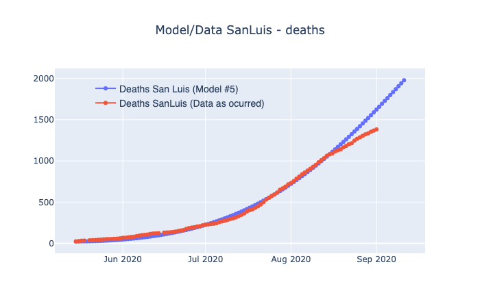

---
output:
  pdf_document: default
geometry: margin=1in
fontsize: 11pt
header-includes :
  \usepackage{geometry}
  \usepackage{graphicx}
  \tolerance=1
  \emergencystretch=\maxdimen
  \hyphenpenalty=10000
  \hbadness=10000
  \linespread{1.3}
  \usepackage[justification=centering, font=bf, labelsep=period, skip=5pt]{caption} 
  \usepackage{titling}
  \usepackage[spanish]{babel}
  \usepackage{fancyhdr}
  \pagestyle{fancy}
  \fancyhead[L]{Investigación Aplicada I}
  \fancyhead[R]{ITAM}
---
```{r setup, include=FALSE}
knitr::opts_chunk$set(echo = FALSE)
```

# Entrega V: 

El modelo que se estimo es el modelo SIR básico caracterizado por el sistema de ecuaciones siguiente.

$$S_{t+1}=S_t-\frac{\beta*S_t*I_t}{P}$$
$$I_{t+1}=I_t+\frac{\beta*S_t*I_t}{P}-\gamma$$

$$R_{t+1}=R_t+\gamma*I-\phi*R_t$$
$$D_{t+1}=D_t+\alpha\phi*R_t$$
$$C_{t+1}=C_t+(1-\alpha)*R_t$$
$$R_{t+1}=\frac{\beta*S_t}{P_i*\gamma}$$

Lo unico que se agrego fue el parametro $\lambda$, con base en la investigación *Delays in death reports and their implications for tracking the evolution of COVID-19* de Emilio Gutierrez, Adrian Rubli y Tiago Tavares. 


# Estimacones de decesos con base en la fecha de reporte


```{r, echo=FALSE, warning=FALSE}
library(knitr)
library(kableExtra)
v2<-read.csv("reportados.csv")

kable(v2, ol.names = c("Mes de corte de datos" ,"I0","Ri","Rf","Lambda","MSQEr","Proyección (120 días)","Máximo por día","Cantidad de días hasta el máximo" ), caption  = "Estimaciones de decesos con base en la fecha de reporte", format="markdown") 

```

```{r, out.width="80%", fig.cap="Modelo con fecha de corte a fin de junio", fig.pos="H"}

```


```{r, out.width="80%", fig.cap="Modelo con fecha de corte a fin de julio", fig.pos="H"}

```

```{r, out.width="80%", fig.cap="Modelo con fecha de corte a fin de agosto", fig.pos="H"}


```


# Estimacones de decesos con base en la fecha de ocurrencia


```{r, echo=FALSE, warning=FALSE}

v3<-read.csv("ocurridos.csv")

kable(v3, ol.names = c("Mes de corte de datos" ,"I0","Ri","Rf","Lambda","MSQEr","Proyección (120 días)","Máximo por día","Cantidad de días hasta el máximo" ), caption  = "Estimaciones de modelos con base en datos de decesos ocurridos", format="markdown") 

```

```{r, out.width="80%", fig.cap="Modelo con fecha de corte a fin de agosto", fig.pos="H"}


```


```{r, out.width="80%", fig.cap="Modelo con fecha de corte a fin de agosto", fig.pos="H"}


```


```{r, out.width="80%", fig.cap="Modelo con fecha de corte a fin de agosto", fig.pos="H"}


```


