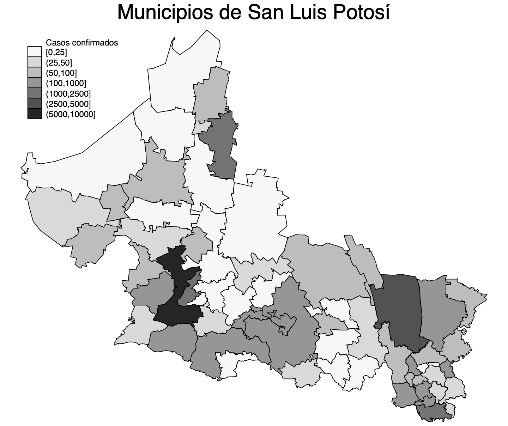
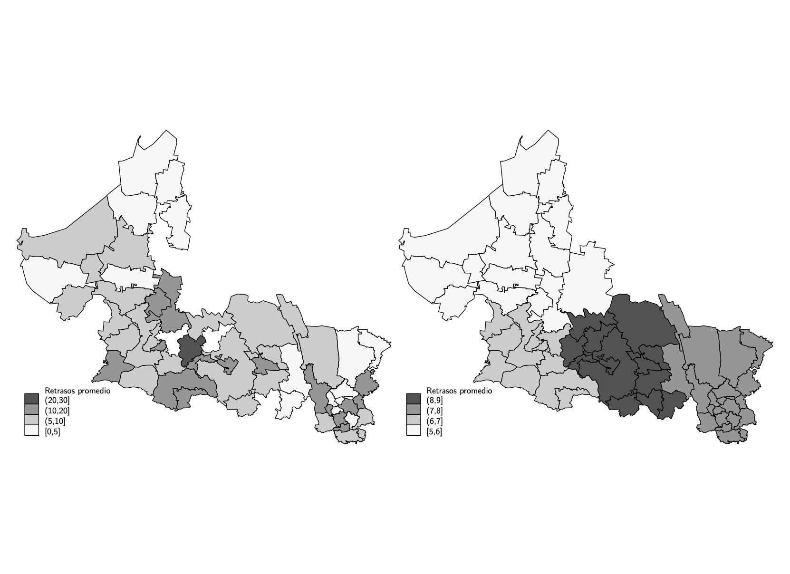

---
output:
  pdf_document: default
geometry: margin=1in
fontsize: 11pt
header-includes :
  \usepackage{geometry}
  \usepackage{graphicx}
  \usepackage{floatrow}
   \floatsetup[figure]{capposition=top}
  \floatsetup[table]{capposition=top}
  \floatplacement{figure}{H}
  \floatplacement{table}{H}
  \tolerance=1
  \emergencystretch=\maxdimen
  \hyphenpenalty=10000
  \hbadness=10000
  \linespread{1.3}
  \usepackage[justification=centering, font=bf, labelsep=period, skip=5pt]{caption} 
  \usepackage{titling}
  \usepackage[spanish]{babel}
  \usepackage{fancyhdr}
  \pagestyle{fancy}
  \fancyhead[L]{Investigación Aplicada I}
  \fancyhead[R]{ITAM}
---
\begin{titlepage}
\begin{center}

\textsc{\Large Investigación Aplicada I}\\[2em]

\textbf{\LARGE Entrega 4}\\[2em]


\textsc{\LARGE }\\[1em]


\textsc{\LARGE }\\[1em]

\textsc{\LARGE }\\[1em]

\textsc{\large }\\[1em]
\textsc{\LARGE }\\[1em]

\textsc{\LARGE }\\[1em]
\textsc{\large Profesor Thiago Tavares}\\[1em]

\textsc{\large Marco Antonio Ramos Juárez}\\[1em]


\end{center}

\vspace*{\fill}
\textsc{Ciudad de México \hspace*{\fill} 2020}

\end{titlepage}


\newpage

```{r setup, include=FALSE}
knitr::opts_chunk$set(echo = FALSE)
```

# Planteamiento de modelo SIR para el estado de San Luis Potosí

Debido a la fragmentación geográfica y cultural del estado de San Luis Potosí, que le permite contar con ecosistemas que van desde desierto hasta selva subtropical; con localidades que cuentan desde el 0% hasta el 80% de población de habla indígena; y con densidades de población que van desde los 3 habitantes por $km^2$ hasta los 1,011; ha existido una evolución regionalizada de la epidemia.

```{r, out.width="40%", fig.cap="Casos confirmados de COVID-19 en San Luis Potosí"}

```


```{r, out.width="80%", fig.cap="Retrasos promedio en los decesos por municipio (izquierda) y por región (derecha) de residencia"}

```


En este sentido, considero que cualquier especificación de un modelo SIR debe contemplar el impacto regional diferenciado. Afortunadamente, existe toda una literatura que ha propuesto soluciones matemáticas. Por ejemplo, la investigación *A multi-region variant of the SIR model*^[https://www.researchgate.net/publication/340115316_A_multi-region_variant_of_the_SIR_model] propone las variables conocidas del modelo general $S(t)$, $I(t)$ y $R(t)$; y los parámetros $\beta$ y $\gamma$ sin embargo en forma de matriz. 

$$S = \begin{pmatrix}s_1\\
\vdots \\ s_n
\end{pmatrix}  
I = \begin{pmatrix}i_1\\
\vdots \\ i_n
\end{pmatrix}
R = \begin{pmatrix}r_1\\
\vdots\\ r_n
\end{pmatrix}$$

$$\beta = \begin{pmatrix}\beta_1\\
 & \ddots\\ & & \beta_n
\end{pmatrix} \gamma = \begin{pmatrix}\gamma_1\\
 & \ddots\\ & & \gamma_n
\end{pmatrix} M = \begin{pmatrix}\rho_{11} &\cdots& \rho_{1n} \\
 & \ddots\\\rho_{n1} & & \rho_{nn}
\end{pmatrix} $$

Lo unico nuevo es la última matriz M que se conoce como matriz de migración y establece las relaciones entre cada región. Particularmente, la $\rho_{ij}$ es el coeficiente de migración entre la región i y la región j. Asimismo, cabe mencionar que $\rho_{jj}=0$. 

De esta manera podemos diferenciar por coeficientes, y establecer las relaciones entre cada región, que en el caso de San Luis son tan solo 4.