---
output:
  pdf_document: default
geometry: margin=1in
fontsize: 11pt
bibliography: library.bib
csl: "mi_chicago.csl"

header-includes :
  \usepackage{geometry}
  \usepackage{graphicx}
  \tolerance=1
  \emergencystretch=\maxdimen
  \hyphenpenalty=10000
  \hbadness=10000
  \linespread{1.3}
  \usepackage[justification=centering, font=bf, labelsep=period, skip=5pt]{caption} 
  \graphicspath{{img/}}
  \usepackage{titling}
  \usepackage[spanish]{babel}
---

```{r setup, include=FALSE}
knitr::opts_chunk$set(echo = FALSE)

```
\begin{titlepage}
\begin{center}

\textsc{\Large Instituto Tecnológico Autónomo de México}\\[2em]


\textbf{\LARGE Investigación Aplicada I}\\[2em]


\textsc{\large }\\[1em]

\textsc{\LARGE El efecto de los retrasos en el reporte de decesos por COVID en las estimaciones de las curvas epidemiológicas para San Luis Potosí y sus regiones}\\[1em]

\textsc{\LARGE }\\[1em]

\textsc{\large }\\[1em]

\textsc{\large Marco Antonio Ramos Juárez}\\[1em]

\textsc{\large 142244}\\[1em]


\end{center}

\vspace*{\fill}
\textsc{Ciudad de México \hspace*{\fill} 2020}

\end{titlepage}

\newpage

\tableofcontents

\newpage

# Motivación

En el contexto de una crisis sanitaria como la que estamos viviendo, es fundamental que la población esté bien informada. La misma Organización Mundial de la Salud (OMS), en sus recomendaciones sobre cómo deben los gobiernos enfrentar crisis epidemiológicas[@who], reconoce que una estrategia de información clara y transparente permite que las personas entiendan mejor los riesgos; tomen acciones precautorias y, en consecuencia, estén de acuerdo con y siguan las medidas de mitigación impuestas. 

La evidencia muestra que los mensajes que la población recibe por parte del gobierno y otras organizaciones puede tener un impacto en la conducta de las personas. Por ejemplo, Simonov, Sacher Dubé y Biswas estimaron el impacto que tiene la información de las noticias en modificar las conductas de las personas con respecto a quedarse en casa durante la epidemia[@Simonov2020]; asimismo, de manera similar, Bursztyn, Rao, Roth y Yanagizawa-Drott argumentan que la exposición a diferentes contenidos tiene resultados diferentes en la conducta de las personas con respecto a la pandemia[@Bursztyn2020].

Por otro lado, debido a las características de cada población y a las distintas capacidades entre gobiernos, el impacto regional y local de la epidemia ha sido altamente heterogéneo, con una dimensión territorial fuerte[@OECD2020]. Esto supone que las estrategias de comunicación y la respuesta de la población pueda llegar a ser muy distinta dentro de un mismo país, e incluso dentro de una entidad subnacional.

Con respecto a México, el gobierno federal y los gobiernos locales han hecho esfuerzos importantes para informar a la ciudadanía: conferencias de prensa diaria, donde se presentan cifras sobre el número de casos y decesos confirmados y sospechosos, y cifras sobre ocupación hospitalaria (en camas generales y de cuidados intensivos). Sin embargo, han surgido diversas críticas sobre inconsistencias en la información que se presenta así como de contradicciones entre los distintas niveles de gobierno. Por ejemplo, un mensaje contradictorio ocurrió cuando la Secretaría de Salud indicó que había 185 personas intubadas en todo el país mientras que ese mismo día la propia Jefa de Gobierno informó que tan solo en la Ciudad de México la cifra ascendía a 265 personas [@DiazOmar2020].En el caso de San Luis Potosí, de acuerdo al periodico Pulso, las autoridades locales con frecuencia muestran cifras distintas a las federales sobretodo en cuanto a la cantidad de contagiados y decesos[@pulso2020]. 

Inconsistencias en la información y en la manera en que se presenta pueden generar dificultades a la hora de que la ciudadanía la interprete. La literatura sugiere que este tipo de inconsistencias pueden tener impactos en el comportamiento de la audiencia: por ejemplo Charlie Rafkin, Advic  Shreekumar y Pierre-Luc Vautrey, en la investigación experimental *When Guidance Changes: Government Inconsistency and Public Beliefs*, concluyen que cuando las inconsistencias en el mensaje son importantes, los participantes tienen menor propensión a revisar las creencias previas sobre el recuento de muertes y en consecuencia se reduce la confianza en el gobierno[@Rafkin2020]; por su parte, en un ejercicio similar, Emilio Gutierrez, Adrian Rubli y Tiago Tavarez[@Gutierrez2020] concluyen que el presentar información que no toma en cuenta los retrasos en decesos conduce a una menor percepción de riesgo de contagio y a una menor intención de cumplir con el distanciamiento social. 

El contemplar la existencia y magnitud de los retrasos tiene consecuencias importantes a la hora de realizar pronosticos y evaluar la situación de la epidemia, tanto para las autoridades como para la ciudadania y los medios de comunciación. Debido a esta situación que surja la pertinencia de generar maneras de hacer llegar la información de manera adecuada que minimicen la posibilidad de desinformación, malinformación e información parcial. 

El estado de San Luis Potosí supone un caso interesante debido a que, por un lado, existen diversos nodos de contagio que pareciera son independientes entre si; por el otro lado, tanto la capacidad institucional como las características de la población son muy heterogéneas dentro de la entidad, lo que supone retos en cuanto a la generación de información y sobretodo en la atención adecuada. Por ejemplo, en la región despoblada del altiplano, han surgido brotes independientes entre si principalmente debido al regreso de migrantes de EEUU a sus pequeñas comunidades(algunas veces de menos 50 personas)[@SLPJUN2020]; o la región de la huasteca potosina, que además de ser la región más aislada y marginada, al día de hoy es el segundo nodo más grande de la epidemia en el estado[@covid20].

Por ello el propósito de esta investigación es, en primer lugar, analizar los datos que se reportan para San Luis Potosí y sus regiones con el fin de identificar la situación de la epidemia y posibles inconsistencias en la información, principalmente los rezagos en el reporte de decesos; y, en segundo lugar, desarrollar un modelo epidemiológico que nos permita comparar diferentes estimaciones que contemplen los rezagos tantoa nivel estatal como regional. En este sentido, en la siguiente sección se pondrá en contexto la situación y capacidad del estado de San Luis Potosí, tanto a nivel estatal como regional, para enfrentar la epidemia y, en consecuencia, generar la información que reportan a la Secretaría de Salud.


\newpage

# Contexto

El estado de San Luis Potosí cuenta con 2 millones 788 mil 482 habitantes y 4 regiones muy diferentes en cuanto a población, desarrollo y factores de riesgo asociados: el Altiplano, el Centro, la Media y la Huasteca. En el contexto nacional, el estado está considerado con un alto grado de rezago social, medido por indicadores de alfabetización, educación, salud, vivienda, acceso a servicios públicos y hacinamiento. Sin embargo, al interior de la entidad se presenta una gran variabilidad entre los índices dependiendo de la región y la ruralidad de la localidad[@Saludslp2018].

## San Luis Potosí: una imagen general

En cuanto a características generales del estado que pueden impactar el desarrollo de la pandemia así como la capacidad de reporte de información están las siguientes:


**Pobreza:** el 66.66% de la población total se encuentra bajo condiciones de pobreza patrimonial y más de 33.33% está en pobreza extrema[@Saludslp2018].

**Infraestructura institucional:** el estado cuenta con una red extensa de serivicios de salud compuesta por 5 tipos diferentes de apoyo a los servicios: 90 Organizaciones No Gubernamentales, 557 Comités de Salud, 436 Auxiliares de Salud, 897 Promotores Voluntarios y 40 Patronatos Hospitalarios. Asimismo derivado de epidemias previas como aquella registrada en el 2009, el sistema de salud desarrolló un sistema de vigilancia epidemiológica de notificación semanal en el  cual están integrados los todos consultorios adyacentes y farmacias privadas [@Saludslp2018]. 

**Recursos humanos:** de acuerdo a la Subdirección de Recursos Humanos de la Secretaría de Salud de SLP, sólo el 46% de los trabajadores han reportado información de escolaridad. Asimismo es menester señalar que de la inforamción disponible, el 34% de los trabajadores no tiene nivel de licenciatura, lo que genera deficiencias en la administración.  En cuanto a la cobertura de personal de salud en contacto con el paciente, observamos que en cuanto a médicos generales por 3000 habitantes, todas las zonas se encuentran por encima del indicador. En lo que respecta a médicos especialistas observamos que solamente las regiones centro y altiplano sobrepasan el indicador. Mientras que los médicos representan el 15% de los trabajadores, el 50% se compone por personal administrativo, que no apoya en la atención directa de la población[@Saludslp2018].

**Edad:** el grupo de edad más numerosos es aquel de entre 10 y 24 años(28%) seguido por el grupo de edad económicamente activo, de 25 a 44 años. Cabe mencionar que este grupo de edad, el cual ocupa el porcentaje más alto en las 4 las regiones del estado, es el que menos acude a solicitar atención médica[@Saludslp2018]. 

**Alta concentración y disperción de la población:** si bien, el 99% de las localidades son consideradas rurales,  el 62.37% de la población total es considerada urbana: concentrada fundamentalmente en la región centro (ciudad de San Luis Potosí y su área conurbada), seguida por la zonas huasteca y media. Es decir, la población urbana se encuentra muy concentrada en algunos puntos y la población rural en extremo dispersa, con muchas localidades con menos de 50 habitantes[@Saludslp2018].

**Emigración:** el estado tiene tasas de analfabetismo del 10.4%8 por encima de la media nacional, índices de hacinamiento del orden del 38.60%, con una tasa de desocupación abierta del 3.5% y una población económicamente activa que percibe menos de dos salarios mínimos de 56.72%. Esta situación genera incentivos fuertes a la emigración en ubicando a la entidad en el 3º lugar nacional en recibir remesas del exterior, después de Zacatecas y Michoacán. Esto supone un riesgo particular de contagio originado del regreso de migrantes de EEUU pues las comunidades pequeñas y aisladas son especialmente sensibles a la emigración.

**Epicentro logístico-laboral:** el estado es atravesado por la carretera más transitada del país, que es la México – Laredo, y sus varias afluentes; debido a que es un centro logístico nacional y debido a que también forma parte del corredor de migrantes de Centroamérica y Sudamérica[@Saludslp2018].Esta situación hace que el estado sea especialmente vulnerable a la situación epidemiológica en otros lugares como Querétaro, Nuevo León y la CDMX e incluso de otros países.


**Poca capacidad de mantener esquemas de trabajo a distancia:** un factor importante en mitigar la pandemia es la capacidad que cuenta una región para que los trabajos se realicen de forma remota[@OECD2020].En este sentido, se calcula que la tasa de ocupación informal al primer trimestre del 2020 fue del 56% lo cual supone una baja capacidad para realizar una gran parte de las actividades económicas de la entidad de forma remota[@SLP2020].


## San Luis Potosí: 4 historias diferentes 

A nivel regional, el estado es muy heterogénero en cuanto a las capacidades institucionales así como las características de la población. A grandes rasgos, la región Altiplano y Centro son aquellas que gozan de mayor infraestructura institucional para atender la pandemia; la región Media y Huasteca son las regiones con mayor prevalencia de pobreza así como con la mayor composición indígena y rezago educativo; la región Media y la región Altiplano son aquellas con mayor emigración hacia EEUU; finalmente, la región Altiplano y la Huasteca son aquellas que cuentan con las poblaciones más aisladas geográficamente.

La región Altiplano se encuentra al norte del país en el desierto potosino. En ella están establecidas muchas comunidades aisladas entre sí y pocas ciudades. Asimismo, a pesar del despegue industrial que ha tenido en los últimos años sigue siendo una región emigrante lo que indica la existencia de redes familiares que atraviesan las fronteras del país.

La región Centro se encuentra al suroeste del estado, en el bajío potosino. Aquí está la capital potosina así como ciudades conurbanas formando la metropolí de San Luis Potosí. Evidentemente, es una región urbana, industrial y la de mayor riqueza del estado, así como la de mayor densidad de población y hacinamiento. Cuenta con las condiciones institucionales más favorables para enfrentar la pandemia a la par que cuenta con la mayor población.

La región Media se encuentra en el centro-sur del estado. Es una de las dos regiones más pobres, con mayor rezago educativo y con una alta dispersión poblacional. Asimismo, es una región emigrante, predominantemente rural y la segunda en población indígena.

Finalmente, la Huasteca se encuentra al este, enmedio de un ecosistema de tipo bosque humedo.  Mientras que la zona centro es la más poblada, la que representa un riesgo mayor en cuanto a densidad poblacional es la zona huasteca. La mayor concentración de población rural, se presenta en la Huasteca que está viviendo un proceso de migración interna hacia los centros más urbanizados[@Saludslp2018]. Asimismo, es la región con mayor rezago social. En ella  el 48.3% de los individuos vive en condiciones de pobreza de acuerdo con el indicador multidimensional de pobreza del CONEVAL, cifra muy cercana al 49.0% estimado para el país. Asimismo,el 60% vive en localidades menores de 500 habitantes y el 70% son indígenas. Además, los índices territoriales de riesgo alimenticio llegan al 60% de la población y la pobreza patrimonial a niveles de alrededor del 85% de su población.

# Descripción de los datos 

La Secretaría de Salud pone a disposición de la población una base de datos que incluye información detallada sobre cada uno de los casos asociados a Covid-19 de los que se tiene registro hasta ese momento, A partir de ella se han construidos las estadísticas oficiales sobre la evolución de la pandemia. En este capítulo se hará un análisis descriptivo de la información disponible para San Luis Potosí.

Los datos que se publican cada día incluyen información para cada paciente registrado desde el inicio de la pandemia. Las variables pueden dividirse en dos categorías: aquellas cuyo valor se mantiene constante para todas las bases de datos publicadas (y por publicar)^[Estas variables pueden clasificarse en tres subgrupos:  a) características socio-económicas, como el municipio en que reside el paciente, su sexo, edad, nacionalidad, país de origen, y si habla una lengua indígena; b) información sobre la presencia de comorbilidades, como obesidad, diabetes, tabaquismo, EPOC, asma, hipertensión, enfermedades cardiovasculares, enfermedades renales crónicas, inmunosupresiónm y una variable que indica si la paciente estaba embarazada al momento de buscar atención médica; y c) información relativa a los síntomas y atención recibida por Covid-19, como la fecha en que mostró síntomas, la fecha y el tipo de institución de salud en la que buscó atención médica, si la atención que recibió fue ambulatoria y, en caso de haber ingresado al hospital, si, en la fecha en que ingresó, lo hizo a una unidad de cuidados intensivos y si recibió respiración asistida.] y aquellas que pueden cambiar de valor a través del tiempo que son solo dos: el resultado de la prueba de laboratorio de Covid-19 (que puede tomar tres valores: positivo, sospechoso o negativo); y la fecha de defunción. 

## Estadísticas descriptivas 
El cuadro 1 muestra algunas estadísticas descriptivas para los decesos confirmados por Covid-19 de acuerdo con la base de datos publicada al 1 de septiembre. La tercera columna restringe su atención a decesos de pacientes residentes de San Luis Potosí, y la segunda a quienes residen en el resto del país. Por su parte, la cuarta columna presenta la diferencia entre medias de ambos grupos. 

```{r, echo=FALSE, warning=FALSE}
library(knitr)
v1<-read.csv("slp_vs_resto.csv")

kable(v1, col.names = c('Variable','Resto del país', 'San Luis Potosí', 'Diferencia'), caption  = "Características observables de decesos confirmados por Covid-19 en San Luis Potosí frente al promedio naciona", format="pandoc", align = 'c') 

```


Del **cuadro 1** podemos concluir que el perfil de los decesos es muy similar entre San Luis Potosí y el resto del país. Sin embargo, la presencia de algunas comorbilidades clave es ligeramente mayor en el estado, por ejemplo diabetes, EPOC, hipertensión y enfermedad renal crónica, inclusive la variable *Más de una comorbilidad* tuvo una media 6% más grande que la del país. Esto puede deberse a multiplicidad de razones, por ejemplo a que pueda existir una mayor prevalencia de comorbilidades; a que la gente que las padece pueda ser aún más vulnerable en el estado o inculso a que exista un sesgo de selección a la hora de registrar los decesos.

El **cuadro 2** concentra la atención en pacientes con residencia en San Luis Potosí. La segunda columna restringe su atención a decesos confirmados, y la tercera a pacientes con una prueba confirmatoria de Covid-19 cuyo deceso no ha sido reportado. La tercera columna presenta la diferencia en medias entre ambos grupos. 

```{r, echo=FALSE, warning=FALSE}

v2<-read.csv("casos_vs_decesos_slp.csv")

kable(v2, ol.names = c('Variable','Casos confirmados', 'Decesos confirmados', 'Diferencia'), caption  = "Características observables de casos y decesos confirmados por Covid-19 en San Luis Potosí ", format="markdown") 

```

Como en el resto de México y de los demás países, del cuadro podemos concluir que las mujeres, niños, jóvenes y adultos (hasta 50) tienen una menor radio $\frac{Decesos}{Casos}$(letalidad). Por el contrario, el radio es mayor para la población adulta desde los 51 hasta más de 81 años y en general para la presencia de todas las comorbilidades, con excepión del asma.

## Distribución geográfica

En cuanto a la distribución geográfica, la **figura 1** muestra en mayor detalle los casos confirmados por Covid así como los decesos a nivel municipal. Lo que podemos observar es que en primer lugar, existen 3 nodos principales de casos confirmados los cuáles responden a las 3 zonas metropolitanas del estado: Matehuala en la región Altiplano (al norte); la capital del estado San Luis Potosí en la región Centro (al suroeste); y finalmente, Ciudad Valles en la Huasteca (hacia el este). En segundo lugar notamos en la región Altiplano algunos municipios relativamente aislados que presentan de manera considerable casos. En tercer lugar, notamos la existencia de un corredor de municipios que cuentan con 500 a 1000 casos confirmados entre el Centro y la Huasteca, en la región Media. Finalmente, observamos una prevalencia mayor de casos en la mayoría de los municipios de la Huasteca. 

```{r fig1, out.width="100%", fig.cap="Casos (derecha) y decesos (izquierda) confirmados en San Luis Potosí a nivel municipio"}
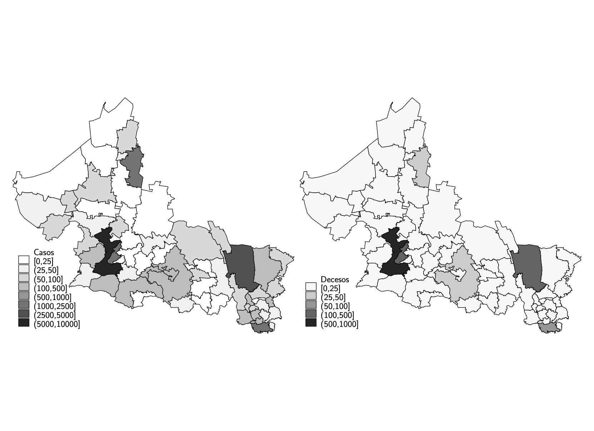
```

Sin embargo, en cuanto a los decesos, podemos notar que ocurre una concentración mayor en las zonas metropolitanas, especialmente en la de la capital, de nuevo, esto podría deberse a una multiplicidad de factores como el hecho de que la población fuera de las zonas metropolitanas es más jóven; la mayor prevalencia de comorbilidades en las zonas urbanas; a mayores retrasos en los reportes en los municipios o incluso a sesgos de selección pues recordemos que las cifras se refieren a casos y decesos confirmados.

En cuanto a la tasa de letalidad, la del estado ronda alrededor del 6.5% (menor a la del promedio nacional de 11.43% y a la del país en su totalidad de 10.7%), sin embargo, como se puede apreciar en el **cuadro 2**, esta varía de manera considerable a nivel municipio. Existen dos municipios con tasas de letalidad demasiado altas: Vanegas (37.5%) y Santa Catarina (30%), sin embargo hay que considerar que en realidad los municipios registraron tan solo 6 y 3 decesos, respectivamente.

```{r, out.width="100%", fig.cap="Tasa de letalidad del país (izquierda) y de San Luis Potosí (derecha)"}
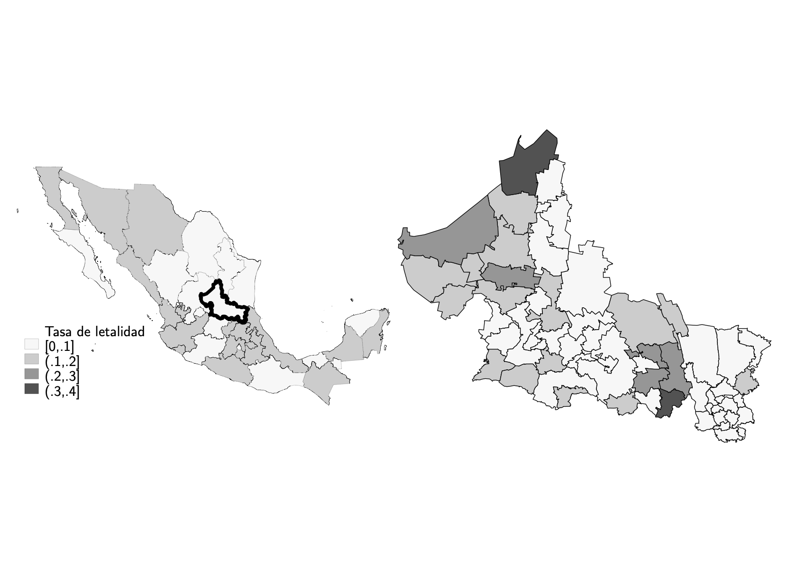
```

En conclusión, el estado de San Luis Potosí tiene un perfil de los decesos similar al del país con la excepción de que hay mayor prevalencia de comorbilidades. Esto puede deberse a una multiplicidad de factores por lo que es dificil atribuir una causalidad. Asimismo, existen 3 nodos geográficos que concentran la mayoría de los casos  confirmados que corresponden a las 3 zonas metropolitanas del estado, en los cuáles, los decesos presentan una concentración geográfica aún más marcada. Finalmente, el estado tiene una tasa de letalidad del 6.5%, menor a la media del país, y aunque a nivel municipal la tasa puede llegar a ser de más del 30% se debe tener en cuenta el tamaño de las poblaciónes.

\newpage

# Análisis descriptivo 

El análisis que presenta este trabajo explota precisamente una de las variables que varían entre reportes de casos de Covid-19 en México: la fecha de defunción. Después de identificar los registros reportados en cada fecha, a cada defunción nos es posible asignarle una fecha de reporte (la primera fecha en que esa defunción apareció en la base de datos) y calcular entonces el retraso con el que fue reportado (los días transcurridos entre la fecha de defunción y la fecha de reporte de cada deceso). 

El primer cuadro de la **figura 3** muestra la frecuencia relativa de los retrasos en reportes de los decesos registrados hasta el 8 de septiembre del 2020 para todo el país (en rojo) y el estado de San Luis Potosí (en gris). Asimismo, el resto de los cuadros  compara los retrasos del país con los de cada región del estado.

```{r, out.width="100%", fig.cap="Frecuencia relativa en los retrasos"}
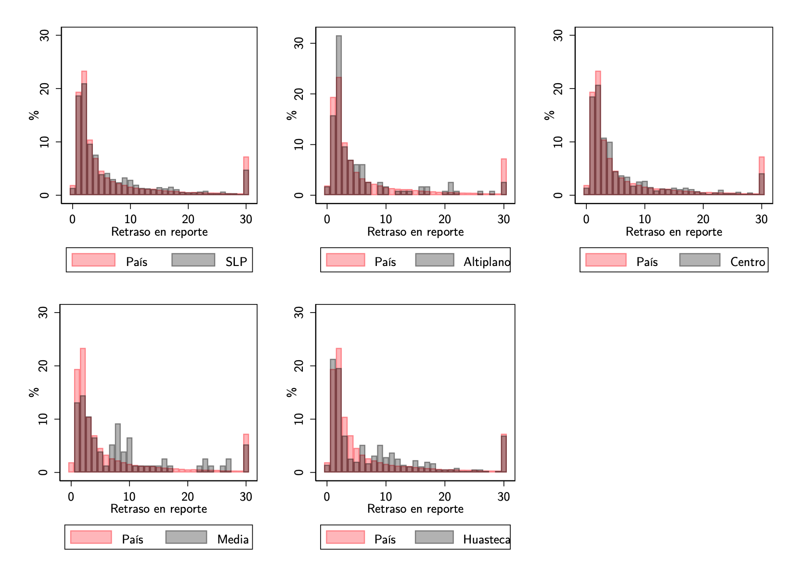
```

Lo que podemos concluir es que los retrasos son grandes y que a nivel estatal tienen una frecuencia relativa similar a la del país. La diferencia considerable entre medias y medianas tanto a nivel estatal (de 4 días), como a nivel regional (que ronda desde los 2 a los 4 días) es evidencia de la dispersión de los retrasos. Sin embargo, cuando desagregamos por región, surjen diferencias notorias. Por ejemplo, la región Altiplano es la región con los retrasos más pequeños seguido del Centro, ambos reportando más de la mitad de los decesos con menos de 4 días de retraso (en ambas regiones la mediana es igual a 3). Por el contrario, podemos observar que la mediana en la región Media es de 7 días, lo que indica que la mitad de los decesos de sus residentes se reportan después de una semana. Asimismo, también es importante notar que en cuanto a los retrasos mayores a 30 días, el estado junto con todas sus regiones con excepción de la Huasteca, tienen un porcentaje menor al del país.

En la **figura 4** se muestran los retrasos promedio en el reporte de decesos por municipio y por región de residencia. Si bien existen municipios en la región altiplano y centro que se encuentran entre aquellos con mayores retrasos promedio, a nivel regional tienen el primer y segundo promedio más pequeño, con 6 y 7 días respectivamente^[ La cifra exacta es de 5.9 y 7 días ], lo que indica que a pesar de los grandes retrasos en algunos municipios, estos se deben a relativamente pocos decesos y apenas modifican al promedio regional.  Por el contrario, en la región huasteca y zona media ocurre que el promedio de los municipios es mayor de manera generalizada y, en consecuencia, las regiones tienen los mayores promedios en retrasos, con 9 y 10 días respectivamente^[ La cifra exacta es de 8.52 y 9.6 días ].

```{r, out.width="70%", fig.cap="Retrasos promedio en los decesos por municipio (izquierda) y por región (derecha) de residencia", fig.align='center'}
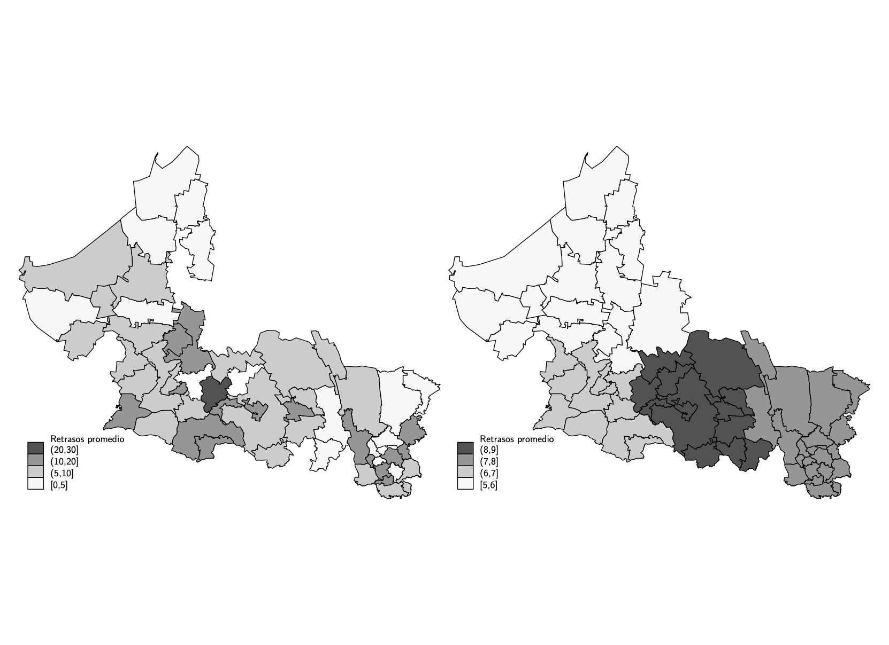
```
 
Finalmente, las **figuras 5 y 6** muestran la evolución de los decesos diarios de acuerdo con la fecha en que ocurrieron (en rojo) y la fecha en que fueron reportados (en gris). El panel A presenta el total de muertes a nivel nacional, mientras el panel B se concentra en el estado de San Luis Potosí. Lo primero que notamos es que las frecuencias de reporte y de decesos ocurridos diarios pueden llegar a ser muy distintas. Asimismo, también notamos un patrón en el reporte de decesos que se debe a que los fines de semana hay menos reportes de decesos. En el caso de San Luis Potosí, podemos observar que la curva del estado despegó casi dos meses de manera postergada a la del país. Asimismo podemos notar que el estado durante el mes de julio tuvo un subreporte de decesos que se acumularon en los reportes de agosto.

Estas gráficas son muy importantes pues nos permiten dimensionar el riesgo de asumir que las fechas de reporte son equivalentes a las fechas de deceso, y en consecuencia minimizar los sesgos en los modelos epidemiológicos. Por ejemplo, el gobierno de San Luis Potosí numerosas veces ha indicado que las primeras dos semanas del mes de agosto fueron probablemente la temporada con mayores decesos ^[https://www.facebook.com/GobEdoSLP/videos/2731443453794902], sin embargo de la gráfica podemos inferir que esa temporada fue la de mayor reporte de decesos, probablemente de muchos que se reportaron con retraso de las últimas dos semanas de julio.

 
```{r, out.width="90%", fig.cap="Curva epidemiológica de decesos de México", fig.align='center'}
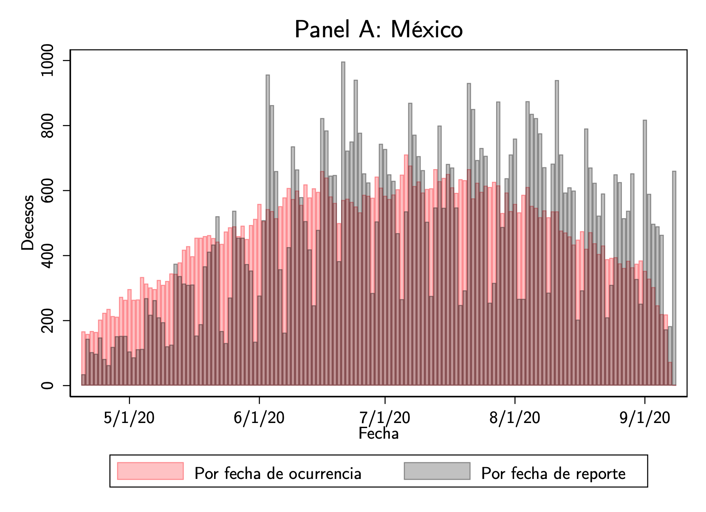
```
```{r, out.width="90%", fig.cap="Curva epidemiológica de decesos en San Luis Potosí", fig.align='center'}
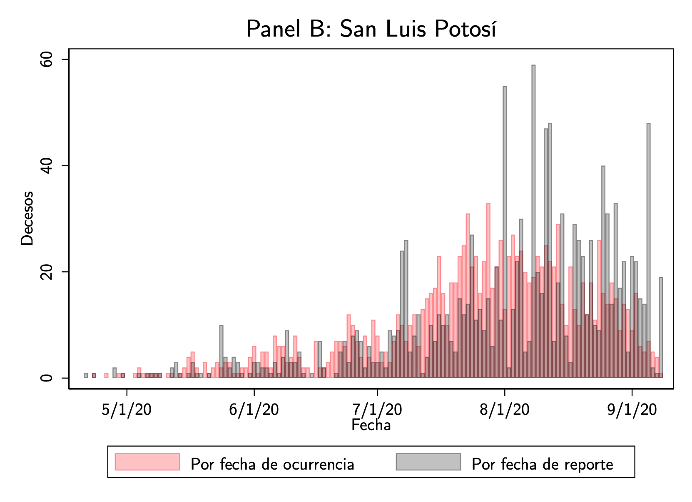
```

\newpage

# Modelo SIR

Para argumentar que las estimaciones con base en los decesos pueden llegar a ser muy diferentes dependiendo si se contemplan o no los rezagos en el reporte; y para argumentar que la evolución de la epdiemía ha sido muy heterogénea dentro de San Luis Potosí, en esta sección se construirá un modelo SIR y se realizaran distintas estimaciones. En la primera parte se hará el ejercicio con 3 diferentes fechas de corte de la base de datos para el estado de San Luis Potosí y en la segunda se realizara con la misma fecha de corte pero se harán estimaciones para cada una de las 4 regiones.

## Modelo

El modelo que se estimo es el modelo SIR básico caracterizado por el sistema de ecuaciones siguiente.

$$S_{t+1}=S_t-\frac{\beta*S_t*I_t}{P}$$
$$I_{t+1}=I_t+\frac{\beta*S_t*I_t}{P}-\gamma$$

$$R_{t+1}=R_t+\gamma*I-\phi*R_t$$
$$D_{t+1}=D_t+\alpha\phi*R_t$$
$$C_{t+1}=C_t+(1-\alpha)*R_t$$
$$R_{t+1}=\frac{\beta*S_t}{P_i*\gamma}$$

Lo unico que se agrego fue el parametro $\lambda$, con base en la investigación *Delays in death reports and their implications for tracking the evolution of COVID-19* de Emilio Gutierrez, Adrian Rubli y Tiago Tavares. 

(profundizar explicación)


## Estimacones de decesos para San Luis Potosí


### Con base en decesos reportados


```{r, echo=FALSE, warning=FALSE}
library(knitr)
library(kableExtra)
v2<-read.csv("reportados.csv")

kable(v2, ol.names = c("Mes de corte de datos" ,"I0","Ri","Rf","Lambda","MSQEr","Proyección (120 días)","Máximo por día","Cantidad de días hasta el máximo" ), caption  = "Estimaciones de decesos con base en la fecha de reporte", format="markdown") 

```

```{r, out.width="80%", fig.cap="Estimación de decesos diarios a nivel estatal con base en decesos reportados",fig.align='center'}
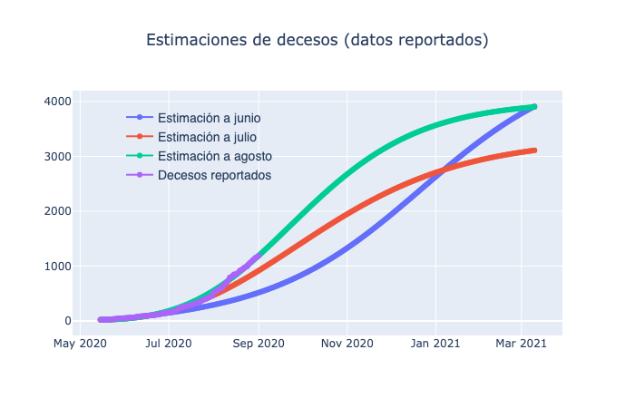
```


```{r, out.width="80%",fig.cap="Estimación de decesos diarios a nivel estatal con base en decesos reportados",fig.align='center'}
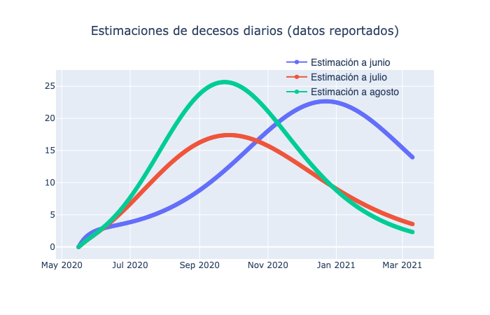
```

\newpage

### Con base en decesos ocurridos

```{r, echo=FALSE, warning=FALSE}

v3<-read.csv("ocurridos.csv")

kable(v3, ol.names = c("Mes de corte de datos" ,"I0","Ri","Rf","Lambda","MSQEr","Proyección (120 días)","Máximo por día","Cantidad de días hasta el máximo" ), caption  = "Estimaciones de modelos con base en datos de decesos ocurridos", format="markdown") 

```


```{r, out.width="80%", fig.cap="Estimación de decesos diarios a nivel estatal con base en decesos ocurridos",fig.align='center'}
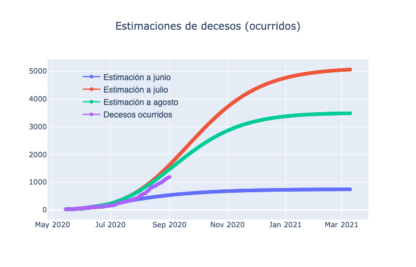
```


```{r, out.width="80%",fig.cap="Estimación de decesos diarios a nivel estatal con base en decesos ocurrdos",fig.align='center'}
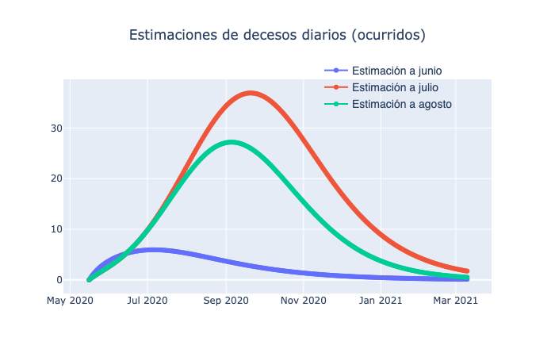
```

\newpage


## Estimaciones regionales

### Con base en decesos reportados

```{r, echo=FALSE, warning=FALSE}

v5<-read.csv("regrep.csv")

kable(v5, ol.names = c("Mes de corte de datos" ,"I0","Ri","Rf","Lambda","MSQEr","Proyección (120 días)","Máximo por día","Cantidad de días hasta el máximo" ), caption  = "Estimaciones de decesos a nivel regional con base en la fecha de reporte", format="markdown") 

```

```{r, out.width="80%", fig.cap="Estimación de decesos diarios a nivel regional con base en decesos reportados",fig.align='center'}
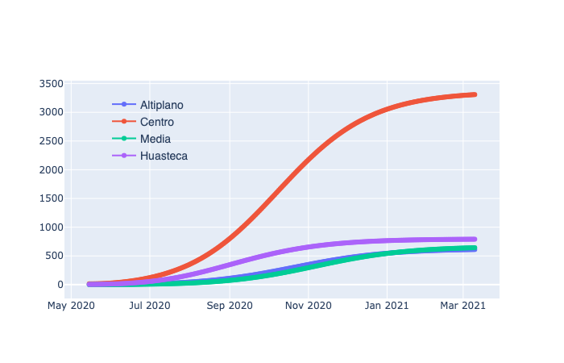
```


```{r, out.width="80%",fig.cap="Estimación de decesos diarios a nivel regional con base en decesos reportados",fig.align='center'}
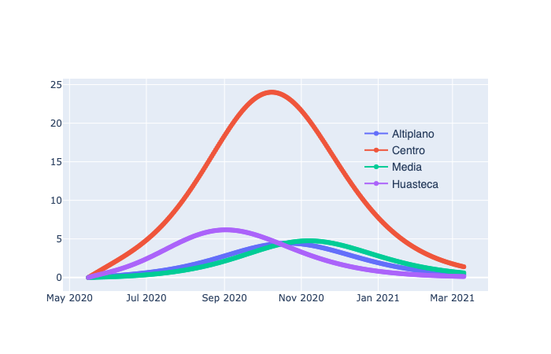
```

\newpage


### Con base en decesos ocurridos

```{r, echo=FALSE, warning=FALSE}

v6<-read.csv("regoc.csv")

kable(v6, ol.names = c("Mes de corte de datos" ,"I0","Ri","Rf","Lambda","MSQEr","Proyección (120 días)","Máximo por día","Cantidad de días hasta el máximo" ), caption  = "Estimaciones de decesos a nivel regional con base en la fecha de ocurrencia", format="markdown") 

```

```{r, out.width="80%",fig.cap="Curva de decesos  a nivel regional con base en decesos ocurridos",fig.align='center'}
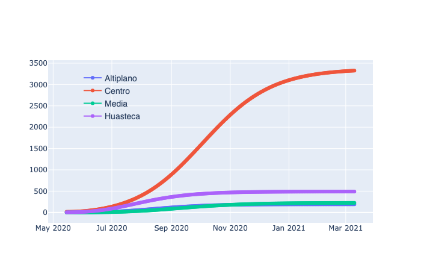
```


```{r, out.width="80%", fig.cap="Estimación de decesos diarios a nivel regional con base en decesos ocurridos",fig.align='center'}
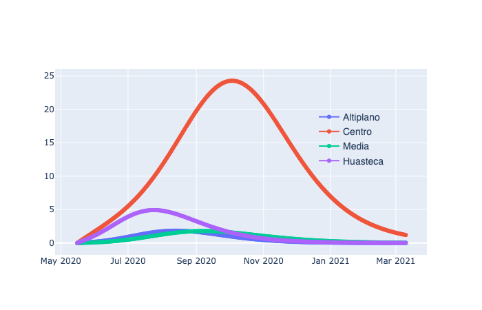
```


\newpage

De estas estimaciones es muy interesante notar que las estimaciones regionales pueden distanciarse considerablemente de la estatal. El caso de la región Centro es muy interesante en el que las predicciones de decesos y la rapidez en que la curva evoluciona son mayores que para la curva estatal, tanto si consideramos o no los rezagos en el reporte.

Otra cosa interesante es que las estimaciones calculadas con base en decesos reportados pueden llegar a ser mayores que las calculadas con decesos ocurridos a pesar de que en las bases de datos es imposible que los decesos reportados sean mayores que los ocrrudos. Esto ocurre debido a que los rezagos tienen un impacto al momento de determinar la velocidad en el crecimiento de las curvas.

(profundizar análisis)

\newpage

# Conclusiones

Sin duda el contemplar o no los rezagos en las estimaciones de curvas epidemiológicas produce que las predicciones sean sustancialmente diferentes. Por ello, la relevancia de esta investigación.


Asimismo, debido a la fragmentación geográfica y cultural del estado de San Luis Potosí, que le permite contar con ecosistemas que van desde desierto hasta selva subtropical; con localidades que cuentan desde el 0% hasta el 80% de población de habla indígena; y con densidades de población que van desde los 3 habitantes por $km^2$ hasta los 1,011; ha existido una evolución regionalizada de la epidemia.

En este sentido, considero que cualquier especificación de un modelo SIR debe contemplar el impacto regional diferenciado. Para futuras investigaciones se podría profundizar sobre los nexos entre las regiones. Afortunadamente, existe toda una literatura que ha propuesto soluciones afines. Por ejemplo, la investigación *A multi-region variant of the SIR model*^[https://www.researchgate.net/publication/340115316_A_multi-region_variant_of_the_SIR_model] propone las variables conocidas del modelo general $S(t)$, $I(t)$ y $R(t)$; y los parámetros $\beta$ y $\gamma$ sin embargo en forma de matriz. 

$$S = \begin{pmatrix}s_1\\
\vdots \\ s_n
\end{pmatrix}  
I = \begin{pmatrix}i_1\\
\vdots \\ i_n
\end{pmatrix}
R = \begin{pmatrix}r_1\\
\vdots\\ r_n
\end{pmatrix}$$

$$\beta = \begin{pmatrix}\beta_1\\
 & \ddots\\ & & \beta_n
\end{pmatrix} \gamma = \begin{pmatrix}\gamma_1\\
 & \ddots\\ & & \gamma_n
\end{pmatrix} M = \begin{pmatrix}\rho_{11} &\cdots& \rho_{1n} \\
 & \ddots\\\rho_{n1} & & \rho_{nn}
\end{pmatrix} $$

Lo unico nuevo es la última matriz M que se conoce como matriz de migración y establece las relaciones entre cada región. Particularmente, la $\rho_{ij}$ es el coeficiente de migración entre la región i y la región j. Asimismo, cabe mencionar que $\rho_{jj}=0$. 

De esta manera podemos diferenciar por coeficientes, y establecer las relaciones entre cada región, que en el caso de San Luis son tan solo 4.


\newpage
# Referencias


